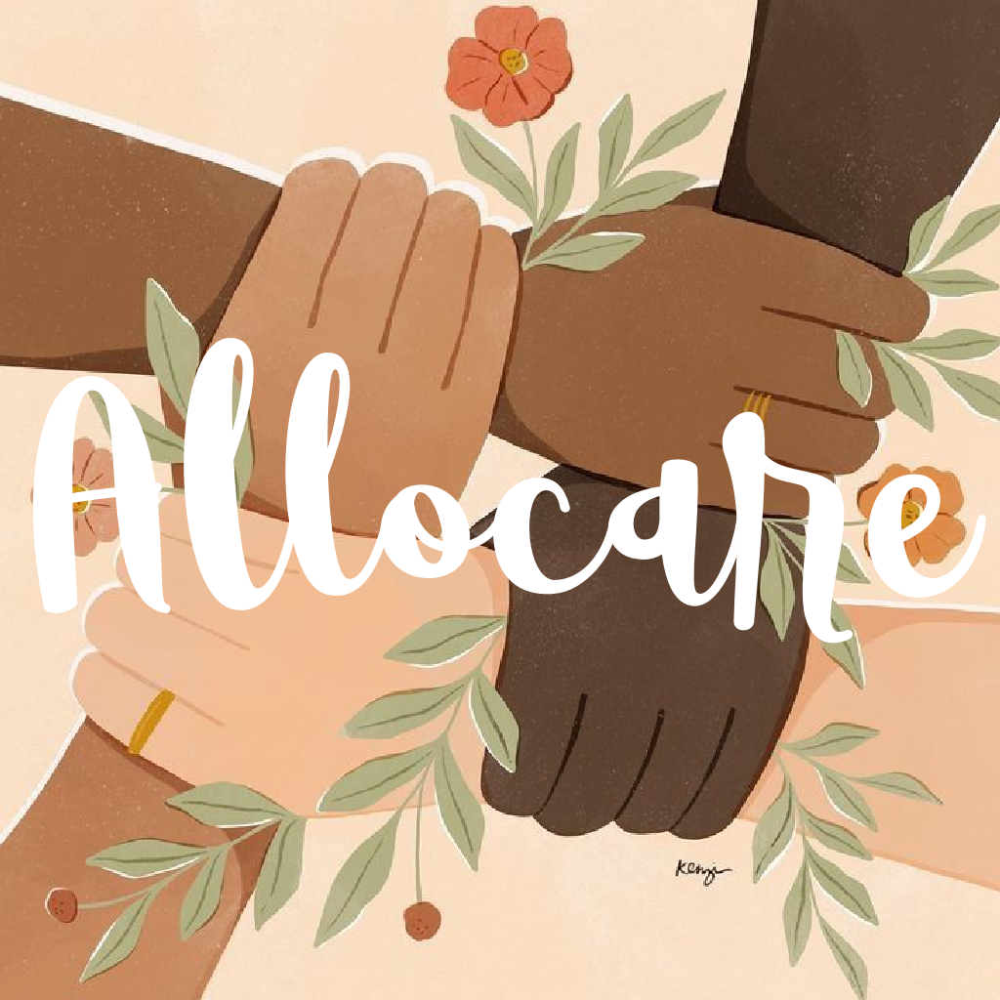
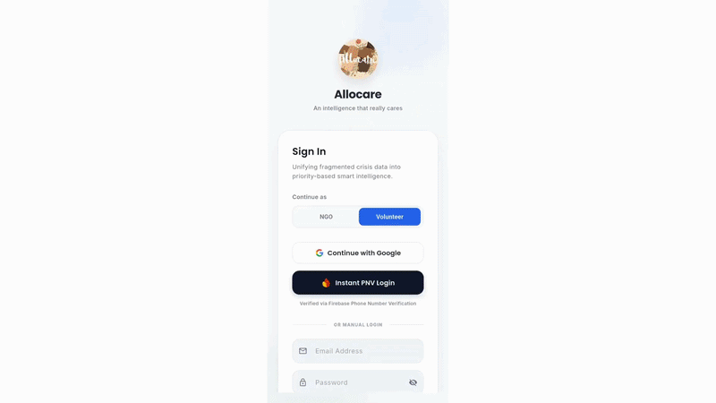
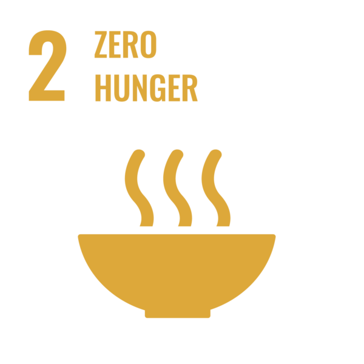
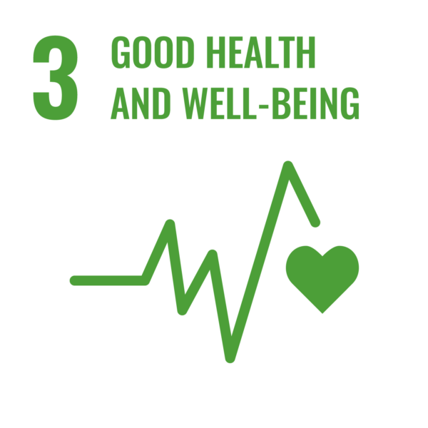
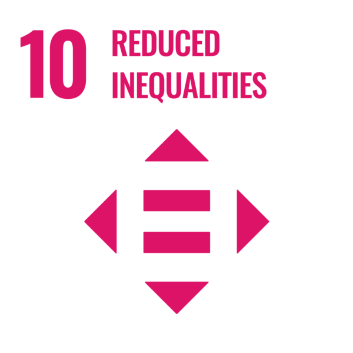

# Allocare

Allocare is a data-driven resource allocation system designed to help NGOs convert fragmented, unstructured data into actionable decisions and real-world impact.

  

  <b>Right Help. Right Place. Right Time.</b>

---

##  Problem

Fragmented and unstructured data in healthcare, food, and mental support leads to inefficient and unfair resource allocation, where some areas receive repeated assistance while vulnerable communities remain underserved.

---

##  Solution

AlloCare transforms disaster relief by using Gemini 2.5 Flash to synthesize fragmented field data—like handwritten notes and audio—into structured, actionable logistics. By employing a Gemma Verify strategy, the system cross-references photos with reports to ensure aid legitimacy and prevent fraud. This intelligence feeds into a real-time Priority-Based Realignment engine that shifts resources and volunteers to high-risk zones instantly. Ultimately, AlloCare synchronizes food, medicine, and mental health into a single, unified care plan, replacing coordination delays with a verified, AI-driven command center.

---

## 🎥 Exclusive Preview

  

## 🧠 Core System Layers

### 1. Data & Visibility Layer
- Collects data from multiple sources (manual input, uploads)
- Converts unstructured data into structured format
- Displays needs on a unified map

---

### 2. Priority & Allocation Layer
- Classifies needs based on urgency and impact
- Enables intelligent assignment of volunteers
- Tracks status: pending → assigned → completed

---

### 3. Insight Layer (Key Differentiator)
- Identifies recurring patterns from historical data
- Highlights critical trends (e.g., malnutrition zones)
- Recommends targeted NGO interventions

---

### 4. Execution Layer
Assigns tasks to volunteers
Enables accept/reject actions
Tracks real-world execution
Updates system in real-time

## 🔑 Core Features (Current Progress)

### ✅ Authentication
- Email/password login & signup (Firebase Auth)
- Role-based access:
  - NGO
  - Volunteer
  - Admin (approval layer)

---

### 🧱 Application Shell
- Bottom navigation structure:
  - Home
  - Needs
  - Map (placeholder)
  - Insights
  - Profile
- Feature-based scalable architecture

---

### 🧾 Needs Management (Planned UI Ready)
- Add and manage needs
- Categories:
  - Medical
  - Food & Nutrition
  - Mental Health
  
---

### 📊 Insights System (Planned)
- Area-based and city-level insights
- Pattern detection from data
- Actionable recommendations

---

### 🗺️ Map (In Progress)
- Placeholder implemented
- Planned:
  - medical pins
  - food heatmaps
  - urgency visualization

---

## 🛠️ Tech Stack

| Component | Technology | Core Purpose |
|-----------|------------|--------------|
| Logic & Synthesis | Gemini 2.5 Flash | Converts fragmented data into structured insights |
| Verification Engine | Gemma 2 | Validates reports using images + text |
| AI Hub | Vertex AI | Manages AI models and performance |
| Real-time Engine | Firestore | Stores live reports and priority queue |
| Media Management | Cloudinary | Optimizes images/videos for low bandwidth |
| Automation | Cloud Functions | Triggers allocation based on AI insights |
| UI Framework | Flutter | Multi-platform app (Android, iOS, Web) |
| Identity & Trust | Firebase Auth | Secure volunteer authentication |
| Geospatial Intel | Google Maps SDK | Visualizes zones and locations |

---

## 🧩 Architecture

- Feature-based modular structure
- Clean separation of UI, models, and logic
- Scalable and maintainable codebase

---

## 👥 User Roles

### NGO
- submit and manage needs  
- view insights and trends  
- coordinate resources  

### Volunteer
- view assigned tasks  
- execute on-ground actions  

### Admin (system-level)
- verify NGOs (no UI, controlled via backend)

---

## 🎯 Vision

Allocare is designed to move beyond static dashboards and become a **real-time decision engine for social impact**, ensuring that:

> The right help reaches the right place at the right time.

---
### 🎯 Supported Goals

  
  
  

| SDG | Impact Through Allocare |
|-----|--------------------------|
| **SDG 2 – Zero Hunger** | Smart food aid allocation during shortages and emergencies |
| **SDG 3 – Good Health & Well-being** | Faster medical response and healthcare resource prioritization |
| **SDG 10 – Reduced Inequalities** | Fair, unbiased distribution of help to underserved communities |
## 📌 Status

🚧 Active Development  
- Auth completed  
- App structure completed  
- Core features under development  

---

## 🤝 Team

Built as part of the Google Solution Challenge.
Team: **TRIVERSAL**
