# Allocare

Allocare is a data-driven resource allocation system designed to help NGOs convert fragmented, unstructured data into actionable decisions and real-world impact.

<p align="center">
  
</p>
<p align="center">
  <b>Right Help. Right Place. Right Time.</b>
</p>

---

##  Problem

Fragmented and unstructured data in healthcare, food, and mental support leads to inefficient and unfair resource allocation, where some areas receive repeated assistance while vulnerable communities remain underserved.

---

##  Solution

AlloCare transforms fragmented crisis reports into verified, structured, and actionable insights.  
Using AI, it predicts airborne and waterborne risks, prioritizes neglected zones, prevents over-allocation, and connects the right resources and volunteers to the right communities in real time.

> From fragmented data → verified insights → fair allocation → real-world action.
---

## 🎥 Exclusive Preview

<p align="center">
  
</p>

---

## 📱 Screen Showcase

<table>
  <tr>
    <td align="center" width="50%">
      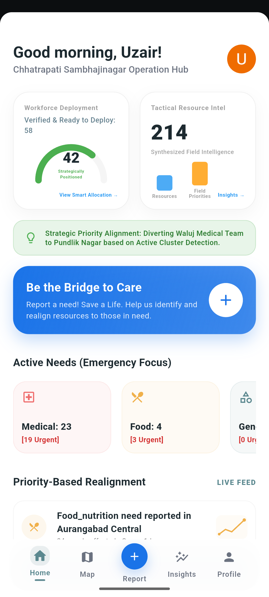<br/>
      <b>Sign In / Role Selection</b><br/>
      <sub>Secure portal for NGOs and volunteers. Uses AI to personalize permissions, dashboards, and task flows based on user roles for efficient operations.</sub>
    </td>
    <td align="center" width="50%">
      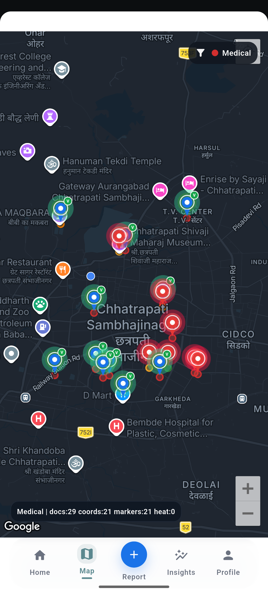<br/>
      <b>Home / Operations Dashboard</b><br/>
      <sub>A real-time command center for workforce readiness and priority alerts. Features AI-driven resource shifts and urgent demand highlighting.</sub>
    </td>
  </tr>
  <tr>
    <td align="center" width="50%">
      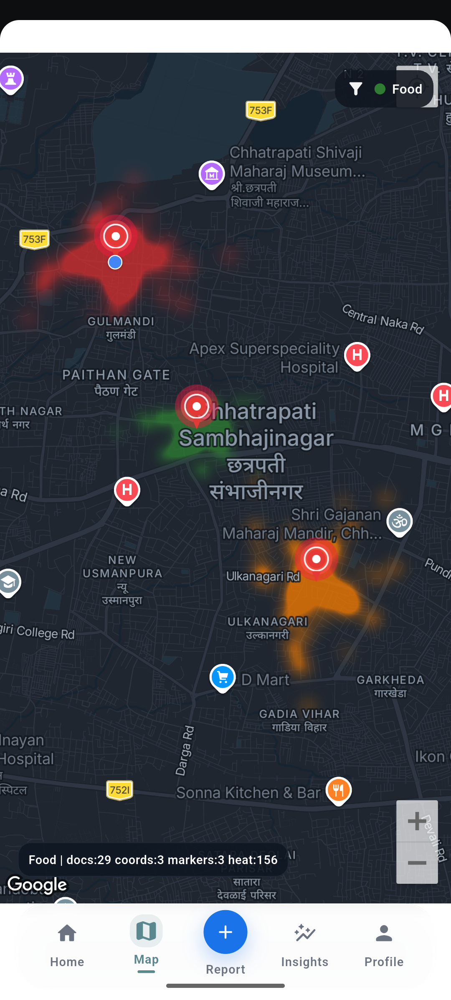<br/>
      <b>Need Category Selection</b><br/>
      <sub>Allows users to classify help requirements, ensuring reports are structured for rapid AI grouping and routing.</sub>
    </td>
    <td align="center" width="50%">
      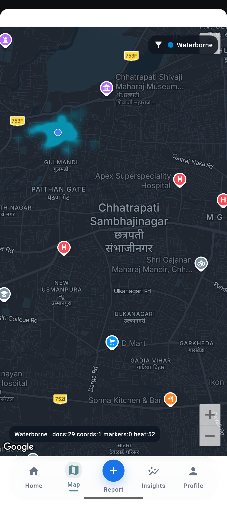<br/>
      <b>Urgency Selection Screen</b><br/>
      <sub>Captures situational severity, allowing response teams to prioritize critical cases and allocate limited resources efficiently.</sub>
    </td>
  </tr>
  <tr>
    <td align="center" width="50%">
      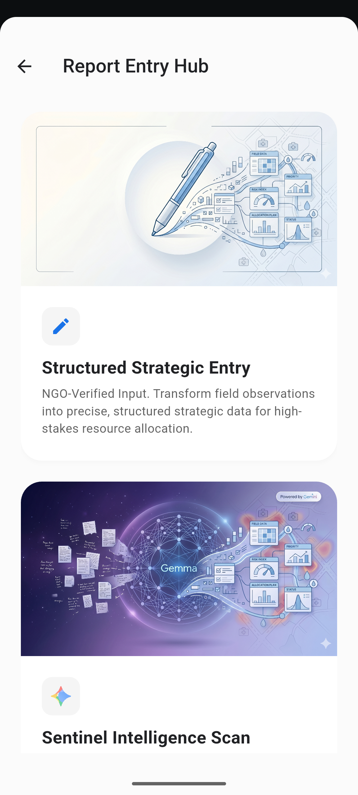<br/>
      <b>Impact Details Screen</b><br/>
      <sub>Collects data on affected individuals and issue descriptions to help AI estimate scale and coordinate the correct response.</sub>
    </td>
    <td align="center" width="50%">
      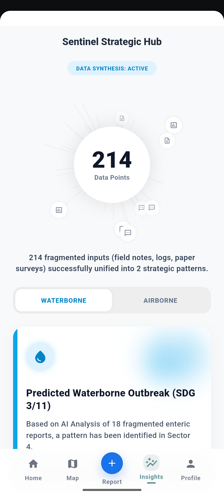<br/>
      <b>Supporting Evidence Screen</b><br/>
      <sub>Enables media and document uploads to validate reports, increasing trust and improving AI decision accuracy.</sub>
    </td>
  </tr>
  <tr>
    <td align="center" width="50%">
      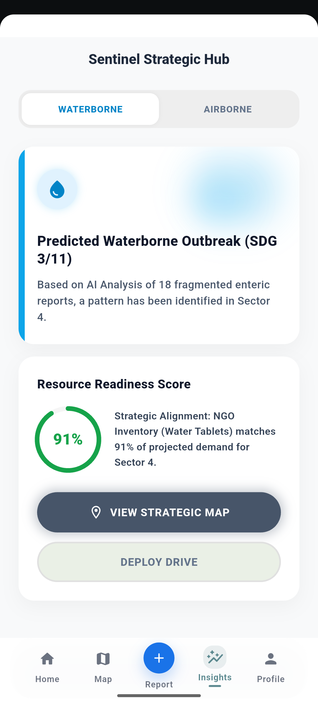<br/>
      <b>Crisis Map Screen</b><br/>
      <sub>Visualizes geolocation signals, hotspot activity, and responder positions to guide navigation and speed up field actions.</sub>
    </td>
    <td align="center" width="50%">
      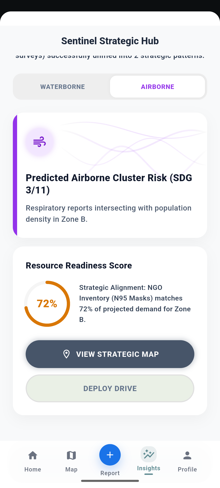<br/>
      <b>Crisis Heatmap Filter Screen</b><br/>
      <sub>Uses Gemini 2.5 Flash to convert fragmented reports into color-coded heat zones to detect emerging patterns and invisible crises.</sub>
    </td>
  </tr>
  <tr>
    <td align="center" width="50%">
      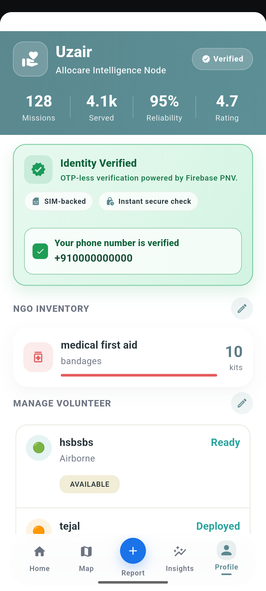<br/>
      <b>Allocare Intelligence Screen</b><br/>
      <sub>Synthesizes field reports and handwritten notes to generate insights and assign the most suitable responders instantly.</sub>
    </td>
    <td align="center" width="50%">
      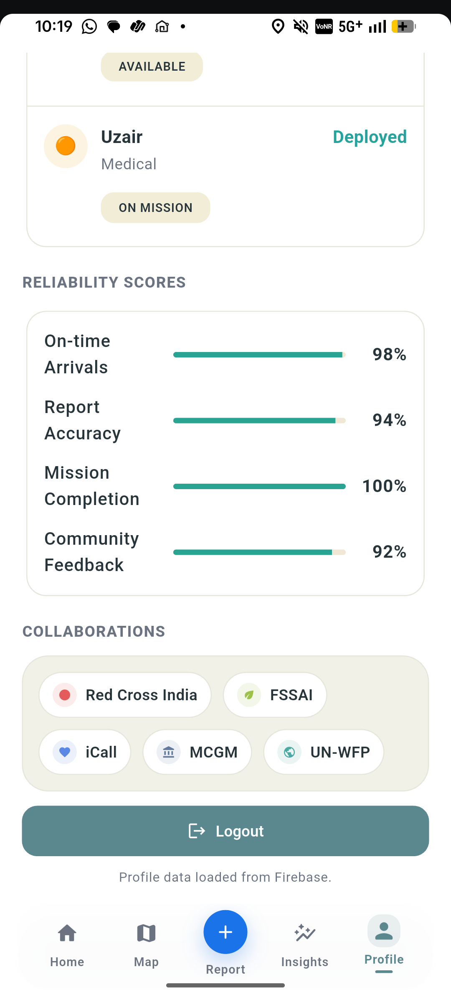<br/>
      <b>Active Force Screen</b><br/>
      <sub>Monitors available volunteers based on skills, distance, and specialization for rapid real-time matching.</sub>
    </td>
  </tr>
  <tr>
    <td align="center" width="50%">
      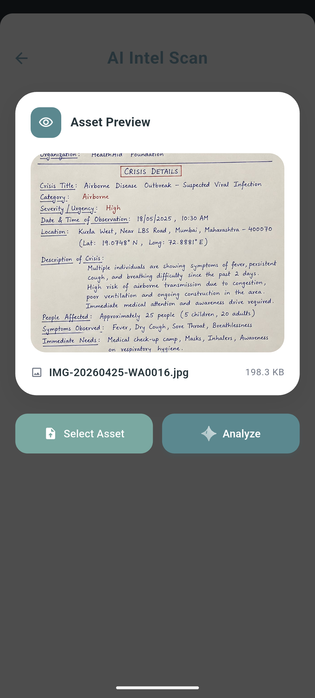<br/>
      <b>Mission Dispatch Screen</b><br/>
      <sub>Instantly assigns specialists with full mission details, affected counts, and optimized navigation data.</sub>
    </td>
    <td align="center" width="50%">
      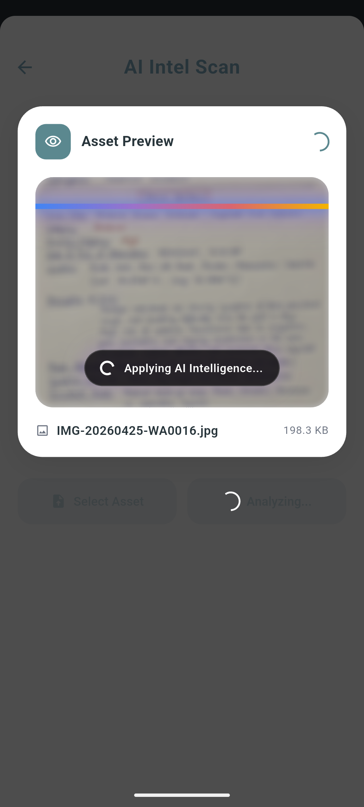<br/>
      <b>Volunteer Assigned Screen</b><br/>
      <sub>Confirms deployment with live location data and responder profiles, giving users visibility that help is on the way.</sub>
    </td>
  </tr>
  <tr>
    <td align="center" width="50%">
      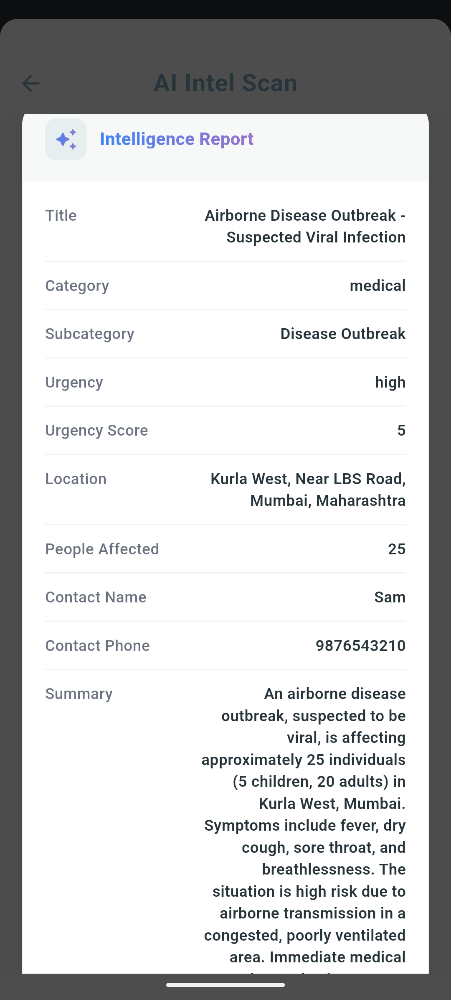<br/>
      <b>Smart Allocation Center</b><br/>
      <sub>Monitors live mission updates and responder status to optimize resources and improve operational coordination in real time.</sub>
    </td>
    <td align="center" width="50%">
      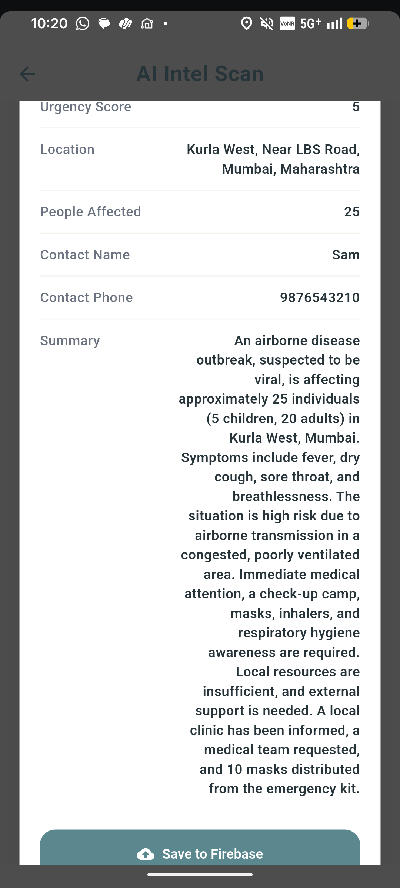<br/>
      <b>Multi-Mission Tracking</b><br/>
      <sub>Manages parallel crisis responses, balancing workloads and reassigning support as priorities shift.</sub>
    </td>
  </tr>
  <tr>
    <td align="center" width="50%">
      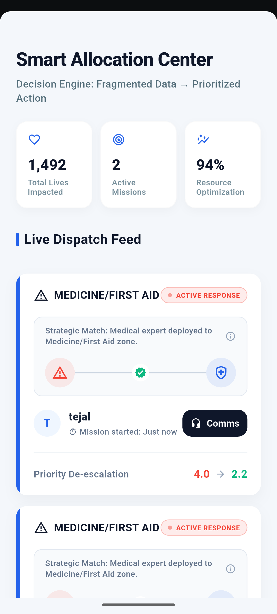<br/>
      <b>Leaderboard Screen</b><br/>
      <sub>Ranks top volunteers based on verified contributions and reliability, gamifying humanitarian impact.</sub>
    </td>
    <td align="center" width="50%">
      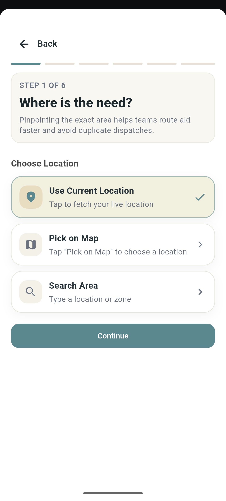<br/>
      <b>Profile / Resource Management</b><br/>
      <sub>Central hub for verification, impact metrics, and inventory oversight to assess workforce capacity and trust.</sub>
    </td>
  </tr>
</table>

---

## 🧠 Core System Layers

### 1. Data & Visibility Layer

- Collects data from multiple sources (manual input, uploads)
- Converts unstructured data into structured format
- Displays needs on a unified map

---

### 2. Priority & Allocation Layer
- Classifies needs based on urgency and impact
- Enables intelligent assignment of volunteers
- Tracks status: pending → assigned → completed

---

### 3. Insight Layer (Key Differentiator)
- Identifies recurring patterns from historical data
- Highlights critical trends (e.g., malnutrition zones)
- Recommends targeted NGO interventions

---

### 4. Execution Layer
Assigns tasks to volunteers
Enables accept/reject actions
Tracks real-world execution
Updates system in real-time

## 🔑 Core Features 
| FEATURE                     | SOLUTION                                                      |
| ------------------------------- | -------------------------------------------------------------------------- |
| **Fragmented Data Structuring** | Converts handwritten notes, audio, forms, and reports into structured data |
| **Photo-Report Verification**   | Checks whether uploaded photos match the report details                    |
| **Duplicate Report Detection**  | Finds repeated or fake reports before allocation                           |
| **Airborne Risk Prediction**    | Predicts possible airborne disease risk zones                              |
| **Waterborne Risk Prediction**  | Predicts possible waterborne disease risk zones                            |
| **Priority Zone Ranking**       | Ranks areas based on urgency, affected people, and past support            |
| **Over-Allocation Prevention**  | Reduces priority of areas that already received recent help                |
| **Neglected Area Detection**    | Highlights areas that have received little or no support                   |
| **Smart Resource Allocation**   | Sends food, medical, or mental health support where it is needed most      |
| **Volunteer Skill Matching**    | Assigns volunteers based on skill, location, availability, and reliability |
| **Live Map Visualization**      | Shows risk zones, needs, and resource gaps on a map                        |
| **Real-Time NGO Dashboard**     | Shows live reports, alerts, resources, and volunteer status                |
| **Unified Care Planning**       | Combines food, healthcare, and mental support in one relief plan           |


---

## 🛠️ Tech Stack

| Component | Technology | Core Purpose |
|-----------|------------|--------------|
| Logic & Synthesis | Gemini 2.5 Flash | Converts fragmented data into structured insights |
| Verification Engine | Gemma 2 | Validates reports using images + text |
| AI Hub | Vertex AI | Manages AI models and performance |
| Real-time Engine | Firestore | Stores live reports and priority queue |
| Media Management | Cloudinary | Optimizes images/videos for low bandwidth |
| Automation | Cloud Functions | Triggers allocation based on AI insights |
| UI Framework | Flutter | Multi-platform app (Android, iOS, Web) |
| Identity & Trust | Firebase Auth | Secure volunteer authentication |
| Geospatial Intel | Google Maps SDK | Visualizes zones and locations |

---

## 🧩 Architecture

- Feature-based modular structure
- Clean separation of UI, models, and logic
- Scalable and maintainable codebase

---

## 👥 User Roles

### NGO
- submit and manage needs  
- view insights and trends  
- coordinate resources  

### Volunteer
- view assigned tasks  
- execute on-ground actions  

### Admin (system-level)
- verify NGOs (no UI, controlled via backend)

---

## 🎯 Vision

Allocare is designed to move beyond static dashboards and become a **real-time decision engine for social impact**, ensuring that:

> The right help reaches the right place at the right time.

---
### 🎯 Supported Goals

<p align="center">
  
  
  
</p>

| SDG | Impact Through Allocare |
|-----|--------------------------|
| **SDG 2 – Zero Hunger** | Smart food aid allocation during shortages and emergencies |
| **SDG 3 – Good Health & Well-being** | Faster medical response and healthcare resource prioritization |
| **SDG 10 – Reduced Inequalities** | Fair, unbiased distribution of help to underserved communities |

---

## 📌 Project Status

| Module | Status |
|--------|--------|
| Authentication (Google + Email) | ✅ Complete |
| App Shell & Navigation | ✅ Complete |
| Field Report Submission (Text) | ✅ Complete |
| Field Report Submission (File / Image) | ✅ Complete |
| Live Map with Risk Zones | ✅ Complete |
| Volunteer Skill Matching | ✅ Complete |
| Sentinel Strategic Hub (AI Insights) | ✅ Complete |
| Smart Resource Allocation Engine | ✅ Complete |
| Real-time Firestore Integration | ✅ Complete |
| Airborne / Waterborne Risk Prediction | ✅ Complete |
| Mental Health & Well-being Support | ✅ Complete |
| Admin Verification Flow | ✅ Complete |

---

## 🚀 Getting Started

> **Prerequisites:** Flutter SDK `^3.x`, Dart `^3.x`, Firebase project, Google Maps API key, and a Gemini API key.

### 1. Clone the Repository

```bash
git clone https://github.com/UzairProg/Allocare.git
cd Allocare/allocare_app
```

### 2. Configure Environment Variables

Copy the example environment file and fill in your keys:

```bash
cp .env.json.example .env.json
```

Edit `.env.json`:

```json
{
  "GEMINI_API_KEY": "your_gemini_api_key_here",
  "GOOGLE_MAPS_API_KEY": "your_google_maps_api_key_here"
}
```

### 3. Set Up Firebase

1. Create a Firebase project at [console.firebase.google.com](https://console.firebase.google.com).
2. Enable **Authentication** (Google Sign-In + Email/Password) and **Firestore**.
3. Run `flutterfire configure` to generate `firebase_options.dart`.

```bash
dart pub global activate flutterfire_cli
flutterfire configure
```

### 4. Install Dependencies

```bash
flutter pub get
```

### 5. Run the App

```bash
# Pass the Gemini key via dart-define (required for AI features)
flutter run --dart-define=GEMINI_API_KEY=your_key_here
```

---

## 🗂️ Project Structure

```
allocare_app/
├── assets/                     # Images, GIFs, icons, SDG badges
├── lib/
│   ├── core/                   # App-wide theme, constants, utilities
│   ├── features/
│   │   ├── auth/               # Login, registration, Google Sign-In
│   │   ├── home/               # Home shell, bottom navigation
│   │   ├── needs/              # Incident / need submission & feed
│   │   ├── reports/            # Field report parser (text & file)
│   │   ├── map/                # Live map, risk zone overlays
│   │   ├── allocation/         # Smart resource allocation engine
│   │   ├── insights/           # Sentinel Strategic Hub (AI insights)
│   │   └── profile/            # NGO profile, volunteer management
│   ├── models/                 # Shared data models
│   ├── services/               # GeminiService, Firebase helpers
│   ├── firebase_options.dart   # Auto-generated Firebase config
│   └── main.dart               # App entry point
├── .env.json                   # Runtime secrets (gitignored)
├── .env.json.example           # Template for .env.json
└── pubspec.yaml
```

---

## 🤖 AI Integration

Allocare uses **Gemini 2.5 Flash** as its core intelligence layer via the `GeminiService`:

| Capability | Detail |
|-----------|--------|
| **Structured Report Parsing** | Converts raw field text into validated JSON with location, urgency, category, and contact data |
| **Binary File Analysis** | OCR-capable parsing of scanned PDFs and images to extract incident details |
| **Multi-model Fallback** | Automatically retries with `gemma-3-27b-it → gemini-1.5-flash → gemini-1.5-pro` if primary model fails |
| **Risk Prediction** | Synthesizes historical reports into airborne/waterborne risk briefings |
| **Volunteer Matching** | Skill-based, location-aware responder assignment |

Gemini is accessed securely via `--dart-define` at build time — **no API key is ever stored in source code**.

---

## 🗺️ Live Map Features

- 📍 Real-time incident pins with category icons
- 🔴 Airborne disease risk heatmap overlay
- 💧 Waterborne disease risk heatmap overlay
- 🎯 Deep-link navigation from AI briefing cards → filtered map view
- 📡 Auto-centers on the operational zone (Chhatrapati Sambhaji Nagar)

---

## 👥 User Roles

| Role | Capabilities |
|------|-------------|
| **NGO** | Submit field reports, view strategic insights, manage volunteers & inventory, coordinate resource allocation |
| **Volunteer** | View assigned missions, accept/reject tasks, update execution status |
| **Admin** | Verify NGO accounts (backend-only, no UI) |

---

## 🔐 Security & Privacy

- All authentication handled via **Firebase Auth** (Google OAuth 2.0 + Email)
- API keys injected at build time via `--dart-define` (never committed to source)
- Firestore security rules enforce role-based access per collection
- No personal volunteer data is exposed across NGO boundaries

---

## 🧪 Running Tests

```bash
flutter test
```

> Unit tests cover `GeminiService` JSON parsing, model serialization, and allocation logic. Integration tests are planned for the next milestone.

---

## 🤝 Contributing

We welcome contributions! Here's how to get started:

1. **Fork** the repository
2. **Create** a feature branch: `git checkout -b feature/your-feature-name`
3. **Commit** your changes: `git commit -m "feat: add your feature"`
4. **Push** to the branch: `git push origin feature/your-feature-name`
5. **Open** a Pull Request — please describe what you changed and why

Please follow the existing code style (feature-based modules, Riverpod for state) and ensure `dart analyze` returns no errors before submitting.

---

## 👨‍💻 Team

Built with ❤️ for the **Google Solution Challenge** by Team **TRIVERSAL**.

---

## 📄 License

This project is licensed under the **MIT License** — see the [LICENSE](LICENSE) file for details.

---

<p align="center">
  <b>Right Help. Right Place. Right Time.</b><br/>
  <i>Made with ❤️ by Team TRIVERSAL</i>
</p>
