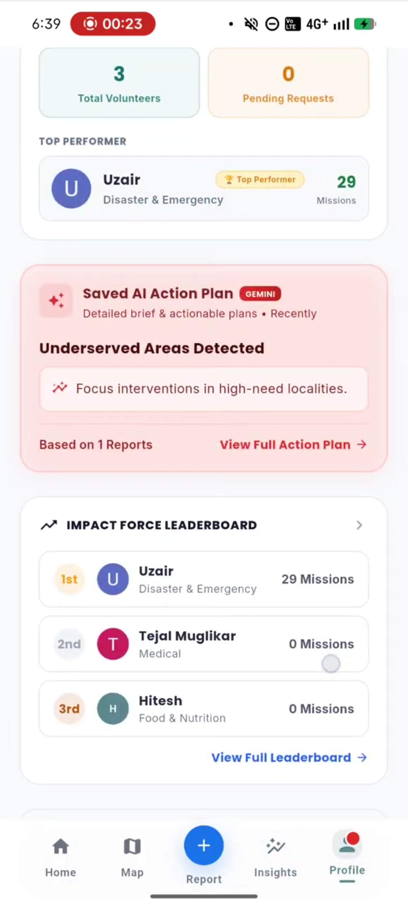

#  ALLOCARE

ALLOCARE unifies scattered community data into actionable intelligence, smart volunteer matching, enabling early risk detection of crises, targeted awareness, and equitable resource allocation for faster humanitarian response.

<p align="center">
  
</p>
<p align="center">
  <b>Right Help. Right Place. Right Time.</b>
</p>

---

##  Problem

Every year, communities across India frequently face heatwaves, floods, disease outbreaks, water contamination, and resource shortages. However, critical information collected by NGOs and volunteers often remains fragmented across reports, spreadsheets, messaging platforms, and disconnected systems. This fragmented data leads to delayed responses, duplicate aid, underserved communities, and missed opportunities for early intervention.

---

##  Why ALLOCARE Matters

India recorded 300+ suspected heat-related illness cases in 2026 as temperatures surged across multiple states.
https://www.reuters.com/world/india/india-records-over-300-suspected-heatstroke-cases-summer-temperatures-spike-2026-05-22

53% experienced water contamination and 52% faced water shortages/droughts.
https://climatecommunication.yale.edu/publications/climate-impacts-india/

57% of Indian districts are at high or very high heatwave risk, affecting 76% of the population.
https://www.reuters.com/sustainability/climate-energy/majority-indian-districts-face-high-heatwave-risk-study-shows-2025-05-20/

---

##  Solution

We asked ourselves a simple question:

What if every volunteer observation could become an early warning signal?

This inspired us to build Allocare—an intelligent humanitarian coordination platform that transforms community reports into real-time intelligence, enabling early risk detection, targeted awareness, prioritized resource allocation, and faster humanitarian action.

> From fragmented data → verified insights → fair allocation → real-world action.

---

##  What Makes ALLOCARE Different?

| Innovation                             | How ALLOCARE Creates Impact                                                         |
| -------------------------------------- | ----------------------------------------------------------------------------------- |
| **Fair Resource Allocation**           | Prioritizes aid distribution based on urgency, impact, and community needs.         |
| **Neglected Area Detection**           | Identifies underserved communities that may be overlooked during response efforts.  |
| **Over-Allocation Prevention**         | Reduces duplicate aid distribution and improves resource efficiency.                |
| **Operational AI Intelligence**        | Converts reports, surveys, images, and field observations into actionable insights. |
| **Intelligent Volunteer Coordination** | Matches volunteers to missions using skills, location, and availability.            |
| **Early Risk Detection**               | Detects emerging health, environmental, and community risks before they escalate.   |

---

## 🎥 Exclusive Preview

<p align="center">
  
</p>


## 🧠 Core System Layers

### 1. Data & Visibility Layer

- Collects data from multiple sources (manual input, uploads)
- Converts unstructured data into structured format
- Displays needs on a unified map

---

### 2. Priority & Allocation Layer
- Classifies needs based on urgency and impact
- Enables intelligent assignment of volunteers
- Tracks status: pending → assigned → completed

---

### 3. Insight Layer (Key Differentiator)
- Identifies recurring patterns from historical data
- Highlights critical trends (e.g., malnutrition zones)
- Recommends targeted NGO interventions

---

### 4. Execution Layer
Assigns tasks to volunteers
Enables accept/reject actions
Tracks real-world execution
Updates system in real-time

## 🔑 Core Features 
| FEATURE                     | SOLUTION                                                      |
| ------------------------------- | -------------------------------------------------------------------------- |
| **Fragmented Data Structuring** | Converts handwritten notes, audio, forms, and reports into structured data |
| **Photo-Report Verification**   | Checks whether uploaded photos match the report details                    |
| **Duplicate Report Detection**  | Finds repeated or fake reports before allocation                           |
| **Airborne Risk Prediction**    | Predicts possible airborne disease risk zones                              |
| **Waterborne Risk Prediction**  | Predicts possible waterborne disease risk zones                            |
| **Priority Zone Ranking**       | Ranks areas based on urgency, affected people, and past support            |
| **Over-Allocation Prevention**  | Reduces priority of areas that already received recent help                |
| **Neglected Area Detection**    | Highlights areas that have received little or no support                   |
| **Smart Resource Allocation**   | Sends food, medical, or mental health support where it is needed most      |
| **Volunteer Skill Matching**    | Assigns volunteers based on skill, location, availability, and reliability |
| **Live Map Visualization**      | Shows risk zones, needs, and resource gaps on a map                        |
| **Real-Time NGO Dashboard**     | Shows live reports, alerts, resources, and volunteer status                |
| **Unified Care Planning**       | Combines food, healthcare, and mental support in one relief plan           |

---

## 📱 Screen Showcase

<table align="center">
  <tr>
    <td align="center" width="25%" valign="top">
      
      <br/><br/>
      <b>NGO Dashboard</b>
      <p>Secure portal and real-time command center for NGOs to manage operations.</p>
    </td>
    <td align="center" width="25%" valign="top">
      
      <br/><br/>
      <b>AI Need Scan</b>
      <p>Instantly scan and generates intelligence reports using gemini.</p>
    </td>
    <td align="center" width="25%" valign="top">
      
      <br/><br/>
      <b>Crisis Map</b>
      <p>Visualize geolocation signals, hotspots, and resources in real time.</p>
    </td>
    <td align="center" width="25%" valign="top">
      
      <br/><br/>
      <b>Tactical Heatmap</b>
      <p>Color-coded risk heat zones and live responder positions on the map.</p>
    </td>
  </tr>
  <tr>
    <td align="center" width="25%" valign="top">
      
      <br/><br/>
      <b>Smart Match</b>
      <p>Real-time details and feedbacks from the volunteers on the field.</p>
    </td>
    <td align="center" width="25%" valign="top">
      
      <br/><br/>
      <b>Volunteer Profile</b>
      <p>Hub for volunteer verification, impact metrics, and skills management.</p>
    </td>
    <td align="center" width="25%" valign="top">
      
      <br/><br/>
      <b>Volunteer Assigned</b>
      <p>Confirm deployment with live tracking and responder profile visibility.</p>
    </td>
    <td align="center" width="25%" valign="top">
      
      <br/><br/>
      <b>Begin Mission</b>
      <p>Volunteers can see the detils and step-wise instructions to complete the mission.</p>
    </td>
  </tr>
  <tr>
    <td align="center" width="25%" valign="top">
      
      <br/><br/>
      <b>Ground Report</b>
      <p>Submit real-time field reports with supporting media and evidence.</p>
    </td>
    <td align="center" width="25%" valign="top">
      
      <br/><br/>
      <b>Voice Intelligence</b>
      <p>Record voice observations in native language to be transcribed, translated, and analyzed by gemini.</p>
    </td>
    <td align="center" width="25%" valign="top">
      
      <br/><br/>
      <b>Report Generated</b>
      <p>Gemini automatically generates structured insights from raw field data.</p>
    </td>
    <td align="center" width="25%" valign="top">
      
      <br/><br/>
      <b>Priority Reassessment</b>
      <p>Dynamically shift resource priorities based on live feedbacks from volunteers on ground.</p>
    </td>
  </tr>
  <tr>
    <td align="center" width="25%" valign="top">
      
      <br/><br/>
      <b>Predictive Modeling</b>
      <p>Gemini anticipates crisis escalation and maps potential resource shortages.</p>
    </td>
    <td align="center" width="25%" valign="top">
      
      <br/><br/>
      <b>Intelligence Card</b>
      <p>Gemini delivers synthesized tactical insights directly to NGO commanders.</p>
    </td>
    <td align="center" width="25%" valign="top">
      
      <br/><br/>
      <b>Brief Generated</b>
      <p>Instantly generate tactical briefs for stakeholders and teams.</p>
    </td>
    <td align="center" width="25%" valign="top">
      
      <br/><br/>
      <b>Strategic Brief</b>
      <p>Comprehensive overview of the ongoing relief effort.</p>
    </td>
  </tr>
  <tr>
    <td align="center" width="25%" valign="top">
      
      <br/><br/>
      <b>Action Plan</b>
      <p>Step-by-step coordinated relief plan combining all support types.</p>
    </td>
    <td align="center" width="25%" valign="top"></td>
    <td align="center" width="25%" valign="top"></td>
    <td align="center" width="25%" valign="top"></td>
  </tr>
</table>

---

## 🛠️ Tech Stack

| Component | Technology | Core Purpose |
|-----------|------------|--------------|
| Logic & Synthesis | Gemini 2.5 Flash | Converts fragmented data into structured insights |
| Verification Engine | Gemma 2 | Validates reports using images + text |
| AI Hub | Vertex AI | Manages AI models and performance |
| Real-time Engine | Firestore | Stores live reports and priority queue |
| Media Management | Cloudinary | Optimizes images/videos for low bandwidth |
| Automation | Cloud Functions | Triggers allocation based on AI insights |
| UI Framework | Flutter | Multi-platform app (Android, iOS, Web) |
| Identity & Trust | Firebase Auth | Secure volunteer authentication |
| Geospatial Intel | Google Maps SDK | Visualizes zones and locations |

---

## 🧩 Architecture

- Feature-based modular structure
- Clean separation of UI, models, and logic
- Scalable and maintainable codebase

---

## 👥 User Roles

### NGO
- submit and manage needs  
- view insights and trends  
- coordinate resources  

### Volunteer
- view assigned tasks  
- execute on-ground actions  

### Admin (system-level)
- verify NGOs (no UI, controlled via backend)

---

## 🎯 Vision

Allocare is designed to move beyond static dashboards and become a **real-time decision engine for social impact**, ensuring that:

> The right help reaches the right place at the right time.

---
### 🎯 Supported Goals

<p align="center">
  
  
  
</p>

| SDG | Impact Through Allocare |
|-----|--------------------------|
| **SDG 2 – Zero Hunger** | Smart food aid allocation during shortages and emergencies |
| **SDG 3 – Good Health & Well-being** | Faster medical response and healthcare resource prioritization |
| **SDG 10 – Reduced Inequalities** | Fair, unbiased distribution of help to underserved communities |

---

## 📌 Project Status

| Module | Status |
|--------|--------|
| Authentication (Google + Email) | ✅ Complete |
| App Shell & Navigation | ✅ Complete |
| Field Report Submission (Text) | ✅ Complete |
| Field Report Submission (File / Image) | ✅ Complete |
| Live Map with Risk Zones | ✅ Complete |
| Volunteer Skill Matching | ✅ Complete |
| Sentinel Strategic Hub (AI Insights) | ✅ Complete |
| Smart Resource Allocation Engine | ✅ Complete |
| Real-time Firestore Integration | ✅ Complete |
| Airborne / Waterborne Risk Prediction | ✅ Complete |
| Mental Health & Well-being Support | ✅ Complete |
| Admin Verification Flow | ✅ Complete |

---

## 🚀 Getting Started

> **Prerequisites:** Flutter SDK `^3.x`, Dart `^3.x`, Firebase project, Google Maps API key, and a Gemini API key.

### 1. Clone the Repository

```bash
git clone https://github.com/UzairProg/Allocare.git
cd Allocare/allocare_app
```

### 2. Configure Environment Variables

Copy the example environment file and fill in your keys:

```bash
cp .env.json.example .env.json
```

Edit `.env.json`:

```json
{
  "GEMINI_API_KEY": "your_gemini_api_key_here",
  "GOOGLE_MAPS_API_KEY": "your_google_maps_api_key_here"
}
```

### 3. Set Up Firebase

1. Create a Firebase project at [console.firebase.google.com](https://console.firebase.google.com).
2. Enable **Authentication** (Google Sign-In + Email/Password) and **Firestore**.
3. Run `flutterfire configure` to generate `firebase_options.dart`.

```bash
dart pub global activate flutterfire_cli
flutterfire configure
```

### 4. Install Dependencies

```bash
flutter pub get
```

### 5. Run the App

```bash
# Pass the Gemini key via dart-define (required for AI features)
flutter run --dart-define=GEMINI_API_KEY=your_key_here
```

---

## 🗂️ Project Structure

```
allocare_app/
├── assets/                     # Images, GIFs, icons, SDG badges
├── lib/
│   ├── core/                   # App-wide theme, constants, utilities
│   ├── features/
│   │   ├── auth/               # Login, registration, Google Sign-In
│   │   ├── home/               # Home shell, bottom navigation
│   │   ├── needs/              # Incident / need submission & feed
│   │   ├── reports/            # Field report parser (text & file)
│   │   ├── map/                # Live map, risk zone overlays
│   │   ├── allocation/         # Smart resource allocation engine
│   │   ├── insights/           # Sentinel Strategic Hub (AI insights)
│   │   └── profile/            # NGO profile, volunteer management
│   ├── models/                 # Shared data models
│   ├── services/               # GeminiService, Firebase helpers
│   ├── firebase_options.dart   # Auto-generated Firebase config
│   └── main.dart               # App entry point
├── .env.json                   # Runtime secrets (gitignored)
├── .env.json.example           # Template for .env.json
└── pubspec.yaml
```

---

## 🤖 AI Integration

Allocare uses **Gemini 2.5 Flash** as its core intelligence layer via the `GeminiService`:

| Capability | Detail |
|-----------|--------|
| **Structured Report Parsing** | Converts raw field text into validated JSON with location, urgency, category, and contact data |
| **Binary File Analysis** | OCR-capable parsing of scanned PDFs and images to extract incident details |
| **Multi-model Fallback** | Automatically retries with `gemma-3-27b-it → gemini-1.5-flash → gemini-1.5-pro` if primary model fails |
| **Risk Prediction** | Synthesizes historical reports into airborne/waterborne risk briefings |
| **Volunteer Matching** | Skill-based, location-aware responder assignment |

Gemini is accessed securely via `--dart-define` at build time — **no API key is ever stored in source code**.

---

## 🗺️ Live Map Features

- Real-time incident pins with category icons
- Airborne disease risk heatmap overlay
- Waterborne disease risk heatmap overlay
- Deep-link navigation from AI briefing cards → filtered map view
- Auto-centers on the operational zone (Chhatrapati Sambhaji Nagar)

---

## 👥 User Roles

| Role | Capabilities |
|------|-------------|
| **NGO** | Submit field reports, view strategic insights, manage volunteers & inventory, coordinate resource allocation |
| **Volunteer** | View assigned missions, accept/reject tasks, update execution status |
| **Admin** | Verify NGO accounts (backend-only, no UI) |

---

## 🔐 Security & Privacy

- All authentication handled via **Firebase Auth** (Google OAuth 2.0 + Email)
- API keys injected at build time via `--dart-define` (never committed to source)
- Firestore security rules enforce role-based access per collection
- No personal volunteer data is exposed across NGO boundaries

---

## 🧪 Running Tests

```bash
flutter test
```

> Unit tests cover `GeminiService` JSON parsing, model serialization, and allocation logic. Integration tests are planned for the next milestone.

---

## 📚 References

1. National Disaster Management Authority (NDMA)
https://ndma.gov.in

2. India Meteorological Department (IMD) – Heatwave & Weather Alerts
https://mausam.imd.gov.in

3. National Centre for Disease Control (NCDC) – Disease Surveillance & Outbreak Monitoring
https://ncdc.mohfw.gov.in

---

## 🤝 Contributing

We welcome contributions! Here's how to get started:

1. **Fork** the repository
2. **Create** a feature branch: `git checkout -b feature/your-feature-name`
3. **Commit** your changes: `git commit -m "feat: add your feature"`
4. **Push** to the branch: `git push origin feature/your-feature-name`
5. **Open** a Pull Request — please describe what you changed and why

Please follow the existing code style (feature-based modules, Riverpod for state) and ensure `dart analyze` returns no errors before submitting.

---

## 👨‍💻 Team

Built with ❤️ for the **Google Solution Challenge** by Team **TRIVERSAL**.

---

## 📄 License

This project is licensed under the **MIT License** — see the [LICENSE](LICENSE) file for details.

---

<p align="center">
  <b>Right Help. Right Place. Right Time.</b><br/>
  <i>Made with ❤️ by Team TRIVERSAL</i>
</p>
